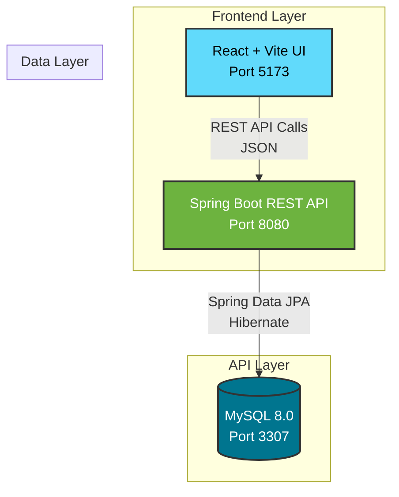

# Retail Pulse Analytics


Retail Pulse Analytics is a modern, enterprise-grade full-stack web application designed to provide real-time, actionable insights into retail operations. Built with a robust Java Spring Boot API and a highly responsive React frontend, the system relies on MySQL for persistent data storage and is fully orchestrated using Docker multi-stage builds.

## Key Features

- **Real-Time Analytics Dashboard:** Interactive data visualizations powered by Recharts, offering clear overviews of category sales and average order values (AOV).
- **Advanced Data Aggregation:** Efficient backend processing utilizing Spring Data JPA Projections to handle complex database aggregation natively.
- **Containerized Infrastructure:** Zero-configuration local deployment using Docker Compose, including robust health checks to prevent database initialization race conditions.
- **Modular Frontend Architecture:** Built with Vite and Tailwind CSS v4, guaranteeing lightning-fast builds and an ultra-modern, dark-themed UI.

## System Architecture

The project utilizes a strict 3-tier architecture to separate concerns, ensuring scalability and maintainability.



## Getting Started

The entire application stack is containerized, ensuring a consistent execution environment regardless of your host operating system.

### Prerequisites

- [Docker](https://docs.docker.com/get-docker/)
- [Docker Compose](https://docs.docker.com/compose/install/)

### Installation Steps

1. **Clone the repository:**
   ```bash
   git clone <your-repo-url>
   cd Retail-Pulse-Analytics
   ```

2. **Start the infrastructure:**
   Build the images and start the containers in detached mode:
   ```bash
   docker-compose up --build -d
   ```
   *Note: The `backend-api` container is programmed to wait automatically until the `mysql-db` container passes its health check.*

3. **Accessing the application:**
   - **Frontend UI:** [http://localhost:5173](http://localhost:5173) (Served internally via Nginx)
   - **Backend API:** [http://localhost:8080/api/analytics](http://localhost:8080/api/analytics)

4. **Accessing the Database:**
   The database automatically seeds itself with initial retail data via `init.sql`. Access the MySQL shell directly inside the container using:
   ```bash
   docker exec -it mysql-db mysql -u root -prootpassword retail_pulse
   ```
   *Alternatively, connect a local SQL client (e.g., DBeaver, DataGrip) to `localhost:3307` using user `appuser` and password `apppassword`.*

## Architectural Design: JPA Projections

A core design pattern implemented within the Spring Boot backend is the translation of complex analytical SQL queries into strongly-typed Java objects using **Spring Data JPA Projections**.

This approach avoids loading deeply nested, relationally-mapped JPA entities into memory, effectively mitigating N+1 query problems and infinite JSON recursion.

### Example Implementation

1. **The JPQL Query:** We construct targeted JPQL queries that join tables and execute aggregate functions directly at the database level.

```java
@Query("SELECT c AS customer, SUM(ro.totalAmount) AS totalSpent " +
       "FROM RetailOrder ro JOIN ro.customer c " +
       "GROUP BY c ORDER BY SUM(ro.totalAmount) DESC")
List<CustomerSpending> getTopCustomersBySpending(Pageable pageable);
```

2. **The Projection Interface:** We define nested static interfaces within the repository that align with SQL aliases. Spring Data proxies these interfaces automatically.

```java
interface CustomerSpending {
    Customer getCustomer();
    BigDecimal getTotalSpent();
}
```

3. **The DTO Mapping:** At the service layer, we transform these interfaces into immutable Java `record` classes to guarantee pristine JSON serialization for the frontend.

```java
public record CustomerSpendingDTO(
    Long customerId, 
    String firstName, 
    String lastName, 
    String email, 
    BigDecimal totalSpent
) {}
```

## Contributing

Contributions are welcome. Please adhere to the following guidelines:
1. Fork the repository.
2. Create a dedicated feature branch (`git checkout -b feature/AmazingFeature`).
3. Commit your changes (`git commit -m 'Add some AmazingFeature'`).
4. Push to the branch (`git push origin feature/AmazingFeature`).
5. Open a Pull Request.

## License

Distributed under the MIT License. See `LICENSE` for more information.